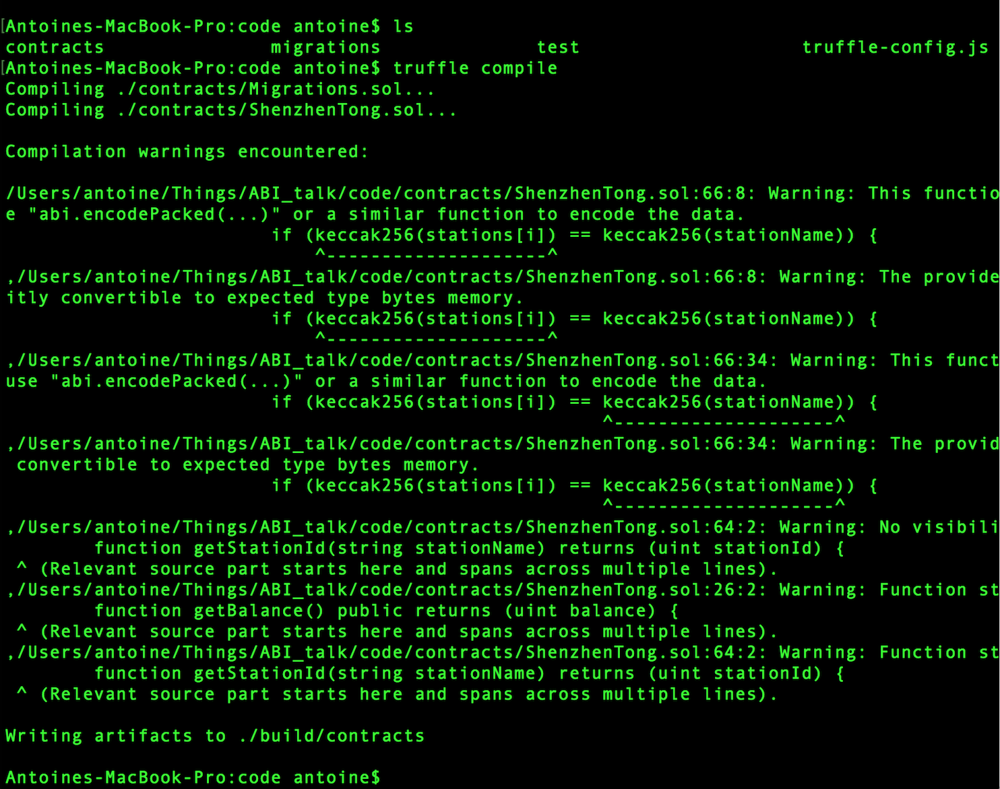
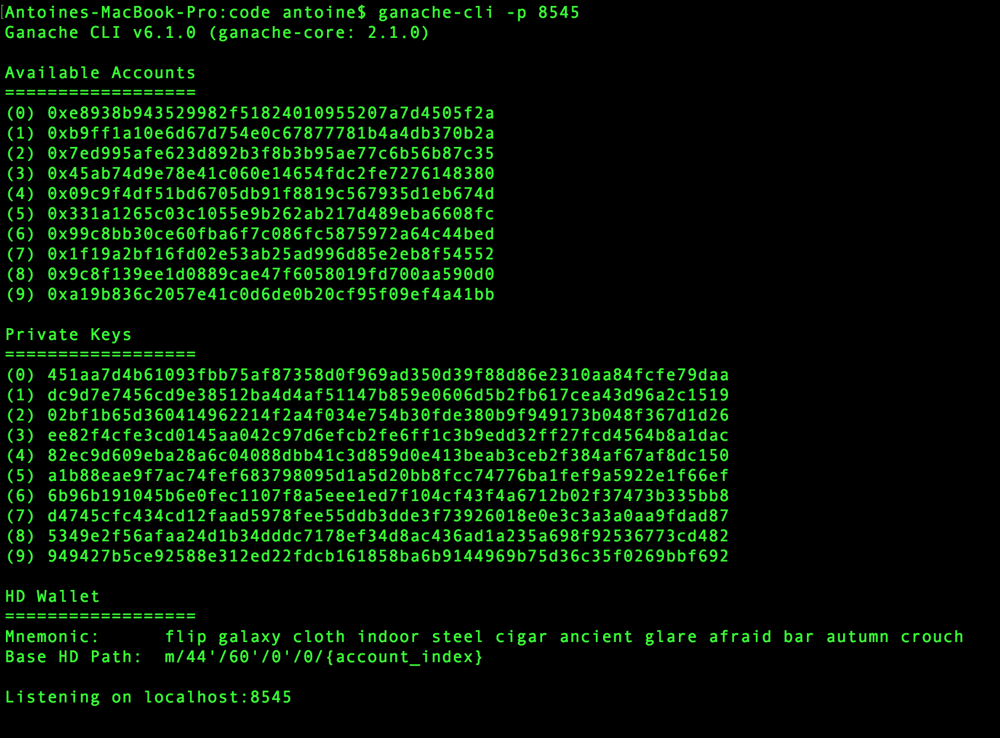
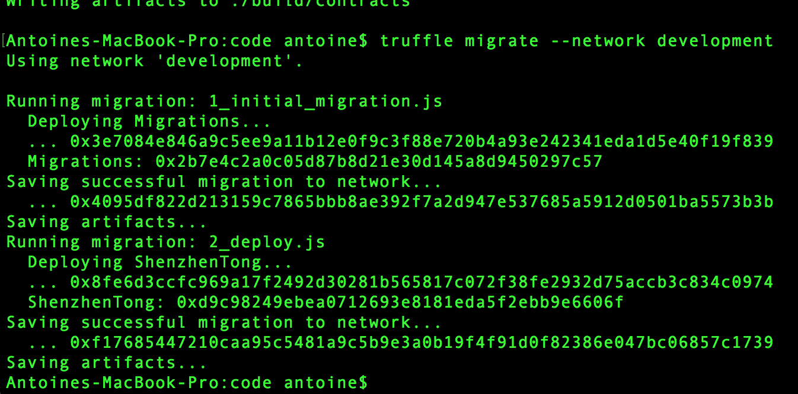
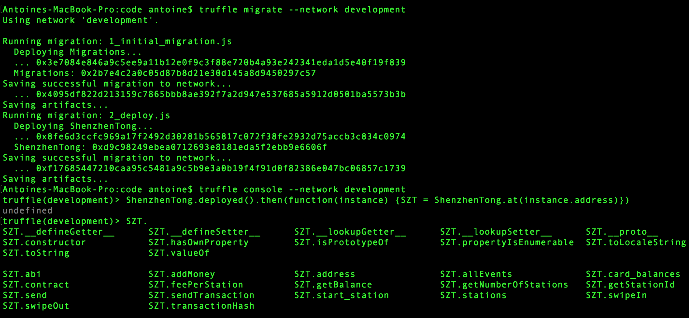

# 怎么运行"深圳通"demo
## 先安装
- Node.js 和 npm
- [Solidity](https://github.com/ethereum/solidity/releases)
- [Truffle](https://www.npmjs.com/package/truffle) (用npm安装: `npm install -g truffle`）
- [ganache-cli](https://www.npmjs.com/package/ganache-cli) (用npm安装: `npm install -g ganache-cli`）

## 运行
1. 用终端进入code夹和运行`truffle compile`

2. 开另一个终端窗口和运行`ganache-cli -p 8545 -b 10` (让继续运行)

3. 回来原来的终端窗口和运行`truffle migrate --network development`

4. 运行`truffle console --network development` (会开truffle的终端）
5. 在truffle的终端运行`ShenzhenTong.deployed().then(function(instance) {SZT = ShenzhenTong.at(instance.address)})`


然后可用`SZT`变量使用合约:
```JavaScript
var userA = web3.personal.listAccounts[1];
SZT.addMoney({from: userA, value: 100});
SZT.getBalance.call({from: userA}).then(function(r) { console.log(r.toString()); }); // 会打印: 100
```
> 加100块和检查你的深圳通余额


```JavaScript
SZT.swipeIn.call('luohu', {from: userA}).then(function(r) {console.log(r.toString());}); // 运行之后要等待新的block
SZT.swipeOut.call("wow", {from: userA}).then(function(r) {console.log(r.toString());}); // 新的block之后可以运行
```
> 在罗湖扫入，在世界之窗扫出。注意运行第一行之后要等ganache做新的block
